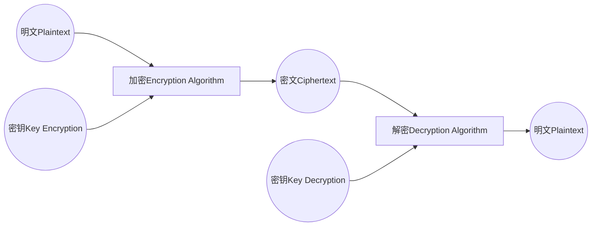

* category
{:toc}


> 计算机网络安全 2014.10

# 一、选择
## 1. 网络蠕虫的编写者是
### A.莫里斯
### B.尼姆亚
### C.阿尔伯特
### D.鲍勃  Worm 网络蠕虫 1988.11 在 UNIX 系统中利用 FTP 漏洞编写 A

> 罗伯特 莫里斯是康奈尔大学计算机系研究生

> TODO 为什么叫蠕虫？P222有简单的介绍。
这是恶意代码的一种分类，可只记主要的 木马 蠕虫 两种。
- 木马，就是潜伏的间谍，远程控制肉鸡电脑。
- 蠕虫，就是能自动传播传染性代码。
另外，病毒 与 恶意代码 少许区别。暂未弄清楚。

## 2. 下列属于被动攻击的是
### A.重放
### B.会话拦截
### C.系统干涉
### D.监视明文
> 答案 P20 绪论->计算机网络不安全的因素 D
- 1.被动攻击，监视公共媒体
- 2.主动攻击，避开或突破安全防护，引入恶意代码
- 3.物理邻近攻击
- 4.内部工作人员攻击
- 5.分发攻击，软硬件开发安装之前，被人恶意修改

## 3. PPDR模型中的R表示
### A.安全策略
### B.防护
### C.检测
### D.响应
> 答案 P30 绪论->计算机网络安全体系结构 D
- OSI 安全体系结构： 安全服务，安全机制
- PPDR(Policy Protection Detection Response) 网络安全模型： 及时的检测和响应就是安全；及时的检测和恢复就是安全

## 4. 链路加密位于
### A.OSI应用层
### B.OSI网络层以下
### C.OSI传输层以上
### D.OSI网络层
> 答案 P75 信息加密与PKI->加密技术的应用 
> 详细内容参考 2014.04 第18题

## 5.计算机机房在设计时首先要考虑的是
### A.减少无关人员进入机房
### B.对磁盘等设备进行防盗保护
### C.保证机房的温度达到标准
### D.防止机房产生静电
> 答案 P42 物理安全->机房安全 

## 6. 根据 GB2887-2000 标准，可将机房供电方式分为
### A.一类
### B.两类
### C.三类
### D.四类
> 答案 P53 物理安全->电源系统安全

- 一类：不间断
- 二类：带备用
- 三类：按一般用户供电考虑

## 7. DES 的有效密钥长度是
### A. 64bit
### B. 56bit
### C. 48bit
### D. 32bit
> 答案 P66 信息加密与PKI->单钥加密算法 
> TODO the detail of DES P67
> 58bit 有效密钥， 8bit 奇偶校验

## 8.双钥密码体制的典型代表是
### A. DER
### B. DSR
### C. DES
### D. RSA
> 答案 P66 信息加密与PKI->加密算法  D
- DER(DIstinguished Encoding Rules，是一种二进制的密钥文件格式)
- DSR（未知）
- DES(Data Encryption Standard)
- RSA（非对称密钥加密算法，RSA是三个发明者的名称首字母， Ron rivest / adi Shamir / leonard Adleman）
> TODO 了解这几种加密方法实现原理

## 9. 关于数字签名与手写签名，下列说法错误的是
### A. 手写签名是不变的
### B. 手写签名容易被模仿，而数字签名几乎无法被模仿
### C. 手写签名和数字签名都容易被模仿
### D. 数字签名对不同的消息是不同的
> 答案 P78 信息加密与PKI->身份认证技术  C
- 手写签名因人而异，数字签名因消息而异
- 手写签名易被模仿，数字签名几乎无法被模仿

## 10. 防火墙对进出网络的数据进行过滤，主要考虑的是
### A. 内部网络的安全性
### B. 外部网络的安全性
### C. Internet的安全性
### D. 内部网络和外部网络的安全性
> 答案 P104 防火墙技术->五大基本功能  A
- 内部网络整体的安全性。书中重点强调的是`整体`两个字，考题却以`内部`为考点

## 11. 包过滤防火墙的工作在
### A.传输层
### B.网络层
### C.物理层
### D.应用层
> 答案 P11 防火墙技术->实现技术 B

## 12. NNTP 的中文含义是
### A. 简单邮件管理协议
### B. 网络消息传输协议
### C. 网络报文管理协议
### D. 简单邮件收发协议
> 答案 P142 防火墙发展动态和趋势 （此题意义不大，跟防火墙相关知识关联太小） 
- SMTP (Simple Mail Transfer Protocol 简单邮件传输 议)
- NNTP (Network News Transfer Protocol 网络新闻传输协议)
- SNMP (Simple Network Management Protocol 简单网络管理协议)

## 13. 漏洞安全威胁中，关于低影响度的说法正确的是
### A. 漏洞的影响较低，不会产生连带的其他安全漏洞
### B. 漏洞可能影响系统的一个或多个模块
### C. 漏洞影响系统的大部分模块
### D. 漏洞的利用显著增加其他漏洞的可利用性
> 答案 P181 网络安全检测技术->网络安全漏洞威胁综合等级分类 
- 从 严重度 和 影响度 两方面进行评估
* 严重度：利用漏洞的难度，分为 低、中、高 三级
* 影响度： 影响其他模块，导致其他漏洞被利用，分为 低、中、高 三级

## 14. ”火炬病毒“ 属于
### A. 引导型病毒
### B. 文件型病毒
### C. 复合型病毒
### D. 链接型病毒
> 答案 P210 计算机病毒与恶意代码防范技术->工作原理和分类  A
- 总共6种分类方式，这里只关心”按照病毒的寄生方式进行分类“的内容：
- 1) 引导型病毒，寄生在磁盘引导区。如 大麻病毒 、2708 病毒
- 2) 文件型病毒，寄生在COM/EXE/DOC文件。如 1575/1591 病毒、Macro/Concept 宏病毒
- 3) 复合型病毒，同时寄生在引导区和文件中。如 Filp病毒、新世纪病毒

## 15. 根据病毒的寄生方式进行分类，计算机病毒分为三种，下列说法正确的是
### A. 引导型病毒是仅寄生在主引导区的计算机病毒
### B. 文件型病毒是寄生在文件中的计算机病毒
### C. 复合型病毒是寄生在磁盘引导区或主引导区的计算机病毒
### D. 引导型病毒是寄生在文件或引导区的计算机病毒
> 答案 P210 计算机病毒与恶意代码防范技术->工作原理和分类 


# 二、填空

## 16. 对计算机网络安全构成威胁的因素很多，综合起来包括偶发因素、自然灾害和 _____ 三个方面。
> 答案 P20 绪论->计算机网络不安全的因素 人为因素


## 17. 计算机网络安全是指利用网络管理控制和技术措施，保证在一个网络环境里，信息数据的机密性，____ 及可使用性受到保护。
> 答案 P24 绪论->网络安全的基本概念 完整性


## 18. 静电对电子设备的损害具有以下特点：____、潜在性、随机性、复杂性。
> 答案 P44 物理安全 -> 机房安全技术 隐蔽性

防静电措施：物体摩擦产生静电，静电放电损坏芯片

静电对电子设备的损害如下：
- 隐蔽性：人体不能直接感知静电，只能感知放电过程，而且必须是 2~3000V的放电电压。
- 潜在性：电子元器件受静电损伤不会立即失效。但多次累加放电会损伤器件。
- 随机性：从生产到损坏前，电子元器件时刻受到静电的威胁。静电产生和器件损坏过程都是随机的。
- 复杂性：静电放电损伤的失效分析工作复杂。技术、设备要求高，也难以与其他损伤区分。


## 19. 电磁辐射的防护措施主要有两类：一类是对____的防护，另一类是对辐射的防护。
> 答案 P51 物理安全 -> 设备安全  传导发射

详细答案参考 2014.04 第26题


## 20. 密码学的五元组中，参与密码变换的参数是____，通常用K表示。
> 答案 P61 信息加密与PKI -> 密码学基本概念  密钥

五元组：
- 明文（Plaintext）
- 密文（Ciphertext）
- 密钥（Key）
- 加密算法（Encryption Algorithm）
- 解密算法（Decryption Algorithm）
- Encryption $C=E_k(P)$
- Decryption $P=D_k(C)$


## 21. 代理服务（Proxy）技术是一种较新型的防火墙技术，它分为______网关和电路层网关。
> 答案 P112 防火墙技术 -> 工作原理  应用层

代理服务技术分
- 应用层网关 (Application Level Gateway)
  * 工作在应用层，专门为特定服务编写。如 HTTP proxy
  * 优点是安全。隐藏内部网络结构。
  * 缺点是相比包过滤类型防火墙慢。
- 电路层网关 (Circuit Level Gateway / TCP Tunnels)
  * 中继TCP连接（个人觉得这应该属于工作在 传输层 的）
  * 不损失安全性的基础上，提高性能

> TODO squid 开源软件属于 应用层网关吗？

防火墙分为`网络层防火墙`和`应用层防火墙`，实现技术主要有：
- 包过滤
- 代理服务
- 状态检测
- NAT技术

## 22. 条件概率预测法、产生式/专家系统、状态转换方法等方法属于入侵检测的______方式。
> 答案 P151 入侵检测技术 -> 入侵检测的技术实现  误用检测

- 误用检测（Misuse Detection 与攻击行为比较，匹配时警告）
- 异常检测（Anomaly Detection 与自身历史行为比较，不匹配时警告）
- 其他检测（神经网络、基因算法……）

> 详细内容，参考思维导图


## 23. 按照漏洞探测的技术特征，安全漏洞探测技术可以划分为：基于应用的探测技术、基于______的探测技术、基于目标的探测技术和基于网络的探测技术。
> 答案 P186 安全漏洞探测技术特征分类 基于主机的检测

没有理解这个分类原则

网络安全漏洞探测技术包括：
- （1） 端口扫描： TCP全连接、TCP半连接、UDP
- （2） 操作系统探测： 基于标识信息（telnet）、基于TCP/IP协议栈、ICMP响应分析
- （3） 安全漏洞探测 ：
  * 可利用方式分类： 信息型漏洞、攻击型漏洞
  * 技术特征分类：基于应用的检测、基于主机的检测、基于目标的检测、基于网络的检测。

> 详细内容，参考思维导图和 2014.04第11题


## 24. 计算机病毒的作用机制分别称为______、传染机制、破坏机制。
> 答案 P206   7.2.1 计算机病毒的工作原理  引导机制

- 1.结构
  * （1）逻辑结构： 引导模块、传染模块、发作模块
  * （2）存储结构：磁盘空间结构、系统型病毒磁盘存储结构、文件型病毒磁盘空间结构
  * （3）内存驻留结构：系统型病毒的内存驻留结构、文件型病毒的内存驻留结构
- 2.作用机制
  * （1） 引导机制（中断与计算机病毒）
  * （2） 传染机制
  * （3） 破坏机制

> 详细内容，参考思维导图和 2014.04第24题


## 25. 在网络和信息安全中属于技术措施的第一道大门，其主 要目的是提供访问控制和不可抵赖的作用，这描述的是______。
> 答案 P237 网络安全解决方案  用户认证

层次划分
- 法律、企业领导层的重视
- 增强的用户认证
- 授权
- 加密
- 审计、监控、数据备份


# 三、简答题

## 26. 保证计算机安全的可用性有哪些措施？
> 答案 P25 緒论->网络安全的目标->保障可用性的措施

- 1.保密性
- 2.完整性
- 3.可用性
  * 提供安全的网络环境
  * 提供访问控制防止未授权的访问
  * 利用完整性、保密性服务防止可用性攻击
- 4.不可否认性
- 5.可控性


## 27. 简述机房安全等级分类及各等级的特点。
> 答案 P41 物理安全->机房安全等级分

- A类，机房有严格的安全要求，完善的安全措施
- B类，机房有较严格的安全要求，较完善的安全措施
- C类，机房有基本的安全要求，基本的安全措施

## 28. 简述防火墙的定义。
> 答案 P103 防火墙技术->概念

- 防火墙是内外网之前执行访问控制的软硬件系统。
- 它是一道屏障，防止侵扰被保护网络。
- 它对两个网络之间的通信进行控制，
  * 强制实施统一的安全策略，
  * 限制外界用户对内部访问的访问，
  * 管理内部用户对外部网络的访问，
  * 防止非法访问重要信息资源，
  * 达到保护内部网络系统安全的目的。

## 29. 简述个人防火墙的优点。
> 答案 P136 防火墙技术->个人防火墙特点

> 详细内容，参考2014.04第8题

- 优点
  * 增加保护级别，`不`需要`额外`硬件`资源`
  * `同时`抵挡`内部`攻击和`外部`攻击
  * 能`隐藏`用户暴露在公共网络上的`信息`
- 缺点
  * `占用个人`计算机的CPU内存等硬件`资源`
  * 防火墙`本身`容易`受到攻击`，因为只有一个物理网口
  * 只能保护单机，`不能保护网络系统`


## 30. 简述入侵检测系统结构的组成。
> 答案 P148 入侵检测技术->概述->系统结构

- 数据提取
  * 提取系统运行日志
- 入侵分析
  * 分析数据，区别正常访问行为和异常访问行为
- 响应处理
  * 发现入侵，触发执行响应措施
- 远程管理
  * 分布监视，集中管理

## 31. 简述端口扫描的原理。
> 答案 P184 网络安全漏洞检测->端口扫描技术

向目标主机的TCP/IP端口发送探测数据包，记录响应。分析响应判断端口打开、关闭状态信息。


# 四、统合分析题

## 32.根据密码学基本概念和加密算法知识，试回答下列问题：
### （1） 简述一般密码系统的模型
> 答案 P61 信息加密与PKI->密码学基本概念



### （2） RSA算法中，使用公钥加密，若P=5，Q=11，公钥E=3，私钥D=27.设26个英文字母可用其字母序号代替，如：A=1，B=2，C=3……。请对”ABCDE“进行加密。
> 答案 P72 信息加密与PKI->加密算法 [^rsa_algorithm_part_one]

- 公式 `N = P * Q = 5 * 11 = 55`
- 公钥 $K_E = 3$
- 私钥 $K_D = 27$

- encrypt(A) = ${A^{K_E}} \mod {N}$ = ${1^{3}} \mod {55}$ = 1
- encrypt(B) = ${B^{K_E}} \mod {N}$ = ${2^{3}} \mod {55}$ = 8
- encrypt(C) = ${C^{K_E}} \mod {N}$ = ${3^{3}} \mod {55}$ = ${3 \times 3 \times 3} \mod {55}$ = 27
- encrypt(D) = ${D^{K_E}} \mod {N}$ = ${4^{3}} \mod {55}$ = ${4 \times 4 \times 4} \mod {55}$ = $64  \mod 55$ = 9
- encrypt(E) = ${E^{K_E}} \mod {N}$ = ${5^{3}} \mod {55}$ = ${5 \times 5 \times 5} \mod {55}$ = $125 \mod 55$ = 15


## 33. 某企业的网络安全设备配置拓扑如题33图所示。

```txt
                互联网
                  |
                  |
                 Pos1 
                  |
                  |
                 Pos2  ------ DMZ 电子商务网站服务器
                  |
                  |
     Pos3 ------ Pos4
                  |
                  |
           +------+--------+------+----+----------+	
           |               |      |    |          |
     WorkStation1         WS2    WS3  WS4     网管计算机
```

### （1） 选用适当的网络安全设备填入题33图的 1~4处。答案写在答是纸上。可选网络安全设备：路由器，防火墙，中心交换机，身份认证服务器
> 答案 P244 网络安全解决方案->方案设计

- 1.路由器
- 2.防火墙
- 3.身份认证服务器
- 4.中心交换机

### （2）请为该企业设计网络安全解决方案。
> 答案 P244 网络安全解决方案->方案设计

- 1.网关处配置多接口防火墙，划分网络为
  * 内部网络
    放置工作主机。
  * DMZ网络
    放置 WEB 服务器，数据服务器。
    所有访问此区域的数据都要经过防火墙模块的检测。
  * 外部网络
- 2.在中心交换机配置基于网络的 IDS 
  * 监控整个网络的流量。
- 3.在DMZ区重要的数据服务器（电子商务网站）配置基于主机的 IDS
  * 记录并审计所有访问情况，防止来自外网（Internet）的攻击。
- 4.对电子商务网站和运营网站（企业Web发布服务器）进行独立配置
  * 对电子商务网站的访问需要身份认证和加密传输，保证电子商务安全性。
- 5.企业总部安装统一身份认证服务器
  * 统一管理所有认证需求，根据安全级别设置认证方案，如静态口令、动态口令、数字证书等。

> DMZ ( Demilitarized Zone 非军事区，与内网、外网都互相独立的区）

> IDS (Intrusion Detect System 入侵检测系统)


[^rsa_algorithm_part_one]: [阮一峰 RSA非对称加密算法原理](http://www.ruanyifeng.com/blog/2013/06/rsa_algorithm_part_one.html)

